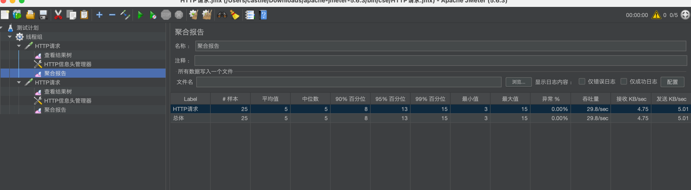

# 访问
curl  -ki -H 'x-biz-tenantId: 1002' http://localhost:9093/provider/hello

curl  -ki -H 'x-cse-context: {"x-biz-tenantId": "1002"}' http://localhost:9093/provider/hello

curl  -ki -H 'x-cse-context: {"x-biz-tenantId": "1002"}' http://localhost:9093/provider/actuator/health

# 并发测试
